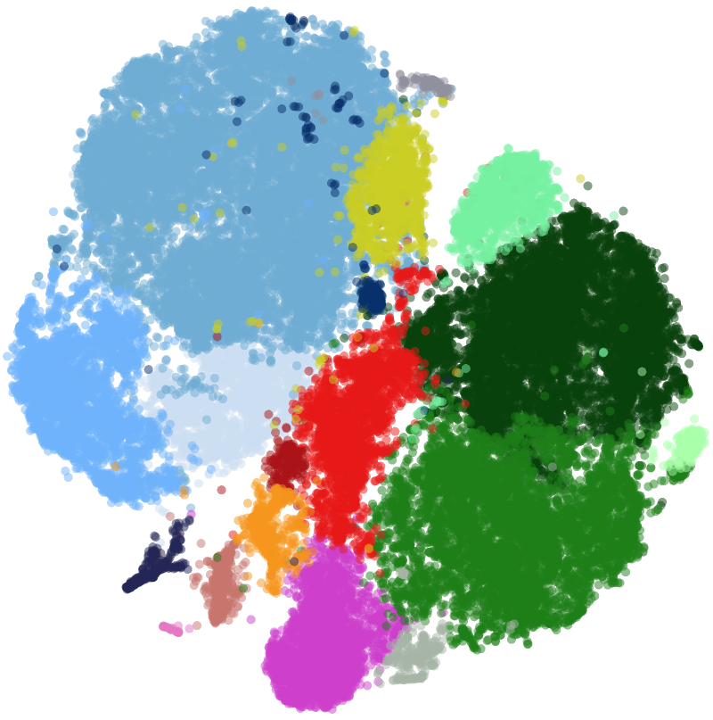
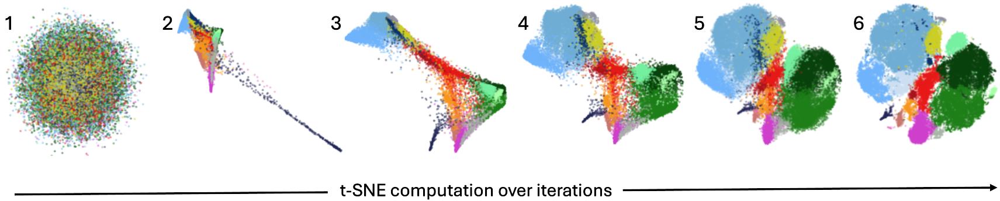
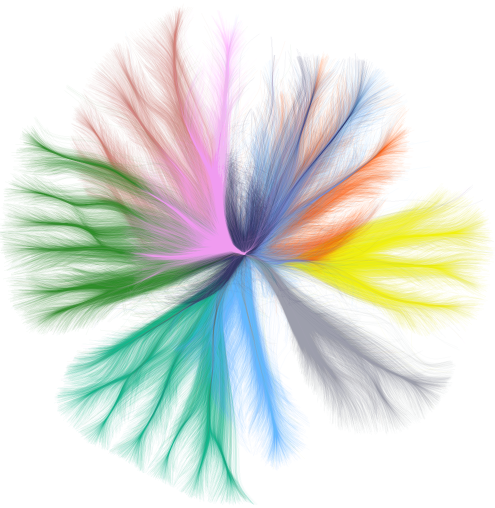
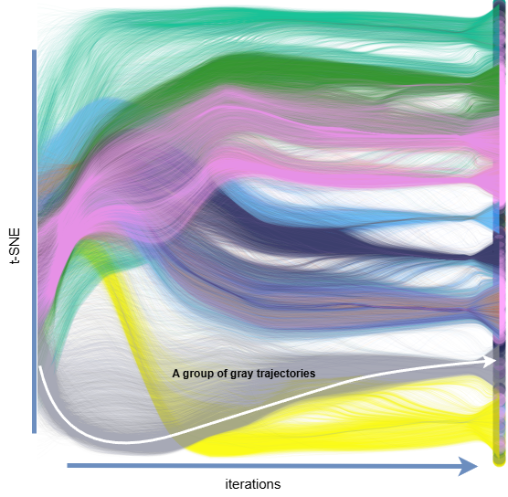

# Background Information

## t-SNE
t-Distributed Stochastic Neighbor Embedding (t-SNE) is a dimensionality reduction technique
commonly used to transform high-dimensional data into two or three dimensions, making it possible to 
interpret the results using conventional visualization techniques like scatterplots. The idea is to preserve
high-dimensional neighborhood of data with low-dimensional embedding. t-SNE algorithm
runs through an iterative process through optimizing the low-dimensional embedding by gradient descent.

Below is an example t-SNE _final_ embedding, which is commonly used in various visual analytics tasks 
through inspecting the neighborhood relationships of points.

Beyond analyzing the _final_ embedding, some tasks can be done by analyzing the intermediate states of the embedding, 
i.e. the optimization process of t-SNE, or t-SNE _dynamics_. 
Below is the typical workflow of analyzing the data dynamics over a t-SNE optimization: researchers either use animation 
or take snapshots at certain moments for further analysis.

This requires going over the intermediate embeddings to check what the data in question is like at that point, 
which is usually a cumbersome process. This inspired us to design 
visualizations that present t-SNE dynamics in only two views: a 2D t-SNE trajectory view and a 1D t-SNE trajectory view 
enhanced by a bundling technique, among some other design choices.

## Our Research
In this questionnaire, we will test the effectiveness of the above-mentioned two views on a number of tasks, 
as well as the traditional method for comparison.

In the 2D view, both the horizontal (X) and vertical (Y) axis are used 
to represent embedding positions. Points usually originate from the center and expand outwards, 
with the amount of movement between iterations being different. In our questions, the 2D view will look like this:

Inm the 1D view, the horizontal (X) axis is encoded with the actual iterations, 
so you can expect the step size at the X-axis to be the same. Points originate from the left and move towards the right 
of the view as the T-SNE algorithm progresses. In our questions, the 1D view will look like this:

The visualization of traditional method looks something like this (speed turned up to save time, same in the actual questions):

## Start Answering Questions
Click **Next** button when you are ready to start. 